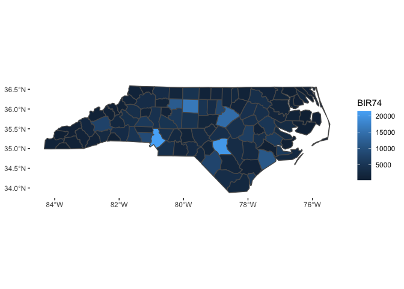

<!-- README.md is generated from README.Rmd. Please edit that file -->

<!-- badges: start -->

[](https://github.com/jayrobwilliams/RWmisc/actions)
[](https://CRAN.R-project.org/package=RWmisc)
[](https://codecov.io/gh/jayrobwilliams/RWmisc)
[](http://www.gnu.org/licenses/gpl-3.0.html)
<!-- badges: end -->

# RWmisc

This package contains convenience functions I have written to help deal
with spatial data spread across multiple UTM zones and aggregating
raster data to overlapping polygons.

# Installation

To install the latest release on CRAN:

``` r
install.packages("RWmisc")
```

You can install the latest development version from GitHub with:

``` r
library(remotes)
install_github("jayrobwilliams/RWmisc")
```

# Examples

The functions contained in this package serve to make working with
spatial data on large scale easy, as when carrying out cross-national
analyses with spatial data. The function `projectUTM` can project `sf`
and `sp` objects in latitude, longitude coordinate reference systems,
and can even re-project already-projected objects in other projected
coordinate reference systems.

``` r
library(sf)
#> Linking to GEOS 3.8.1, GDAL 3.1.4, PROJ 6.3.1
library(RWmisc)

nc <- st_read(system.file("shape/nc.shp", package="sf"))

projectUTM(nc)
```

The `theme_rw` function is the minimalist theme I often use for figure
in my work. While it is useful for standard plots, it is an especially
large improvement over the `ggplot2` defaults for maps.

``` r
library(ggplot2)

ggplot(aes(fill = BIR74), data = nc) +
  geom_sf()

ggplot(aes(fill = BIR74), data = nc) +
  geom_sf() +
  theme_rw()
```


